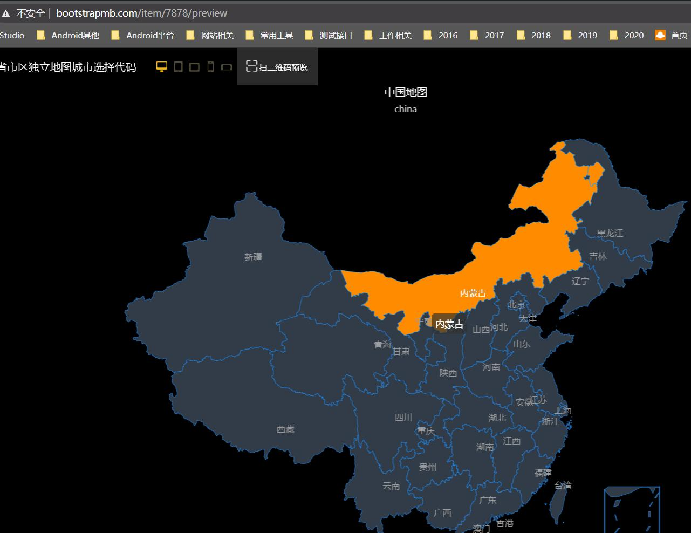
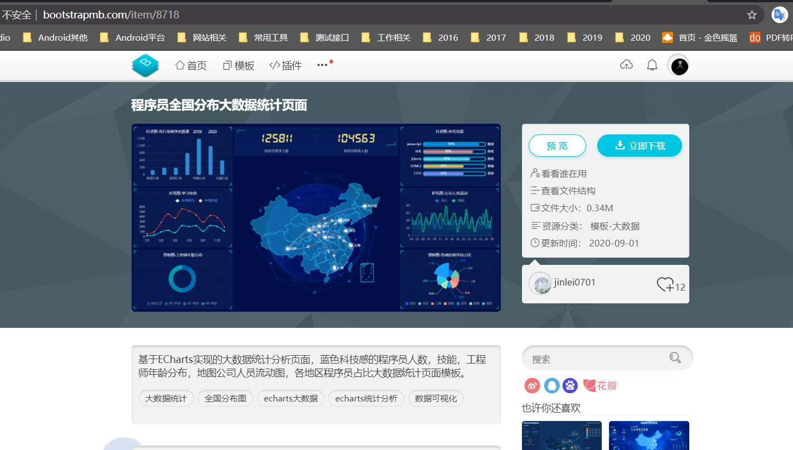
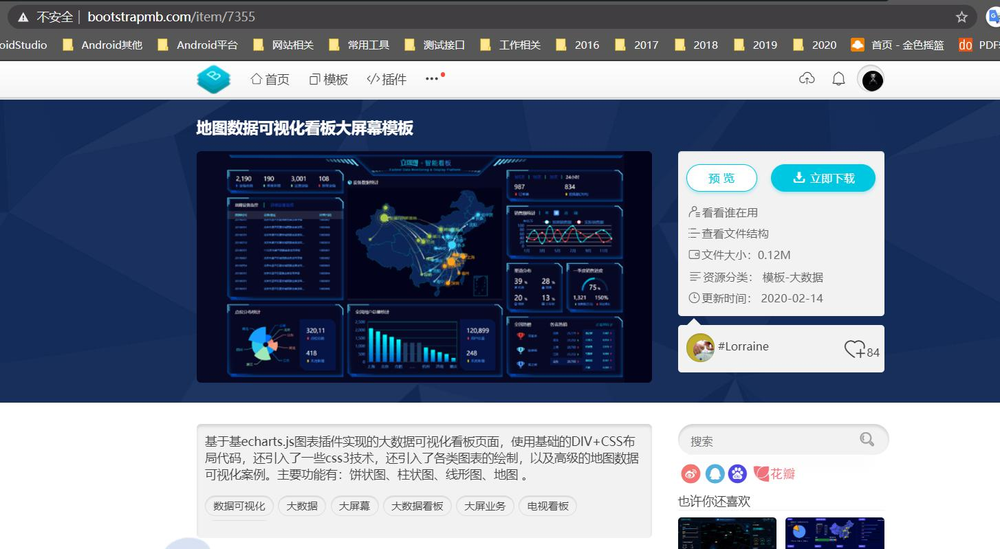

# 大数据界面收集

>该目录数据是使用[bootstrap模板网址的内容][bootstrapmb]

[炫酷echarts省市区独立地图城市选择代码][chinamap]

[程序员全国分布大数据统计页面][devneed]

[地图数据可视化看板大屏幕模板][equipment]

[bootstrapmb]:http://www.bootstrapmb.com/
[chinamap]:http://www.bootstrapmb.com/item/7878/preview
[devneed]:http://www.bootstrapmb.com/item/8718
[equipment]:http://www.bootstrapmb.com/item/7355
