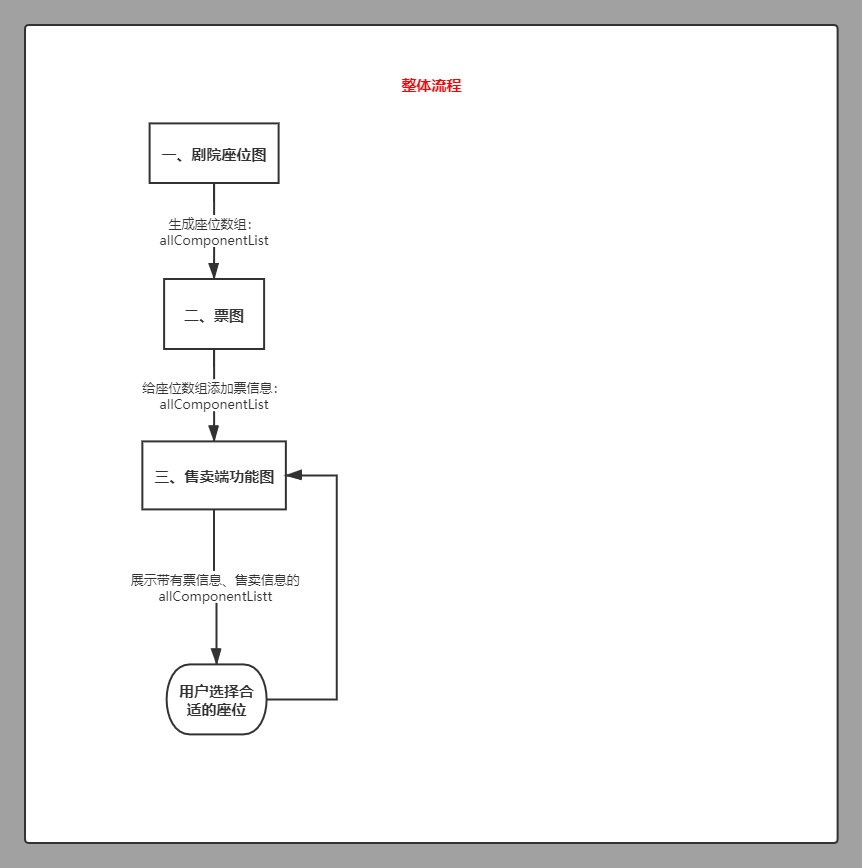
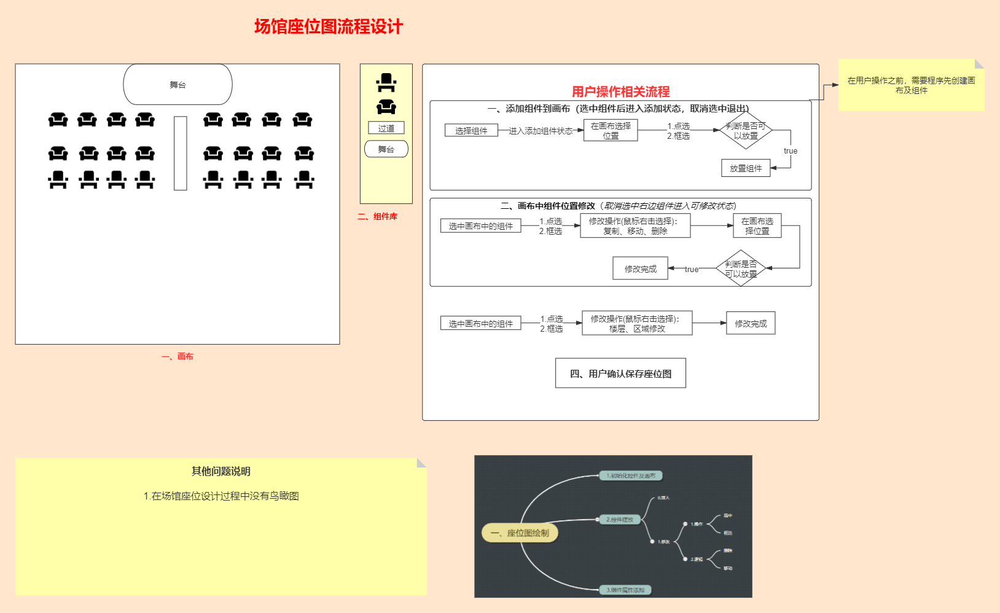
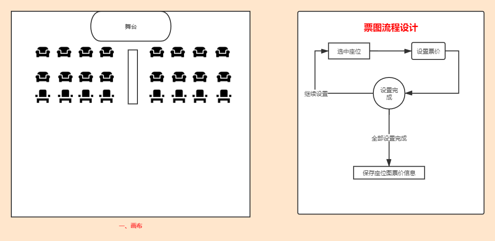
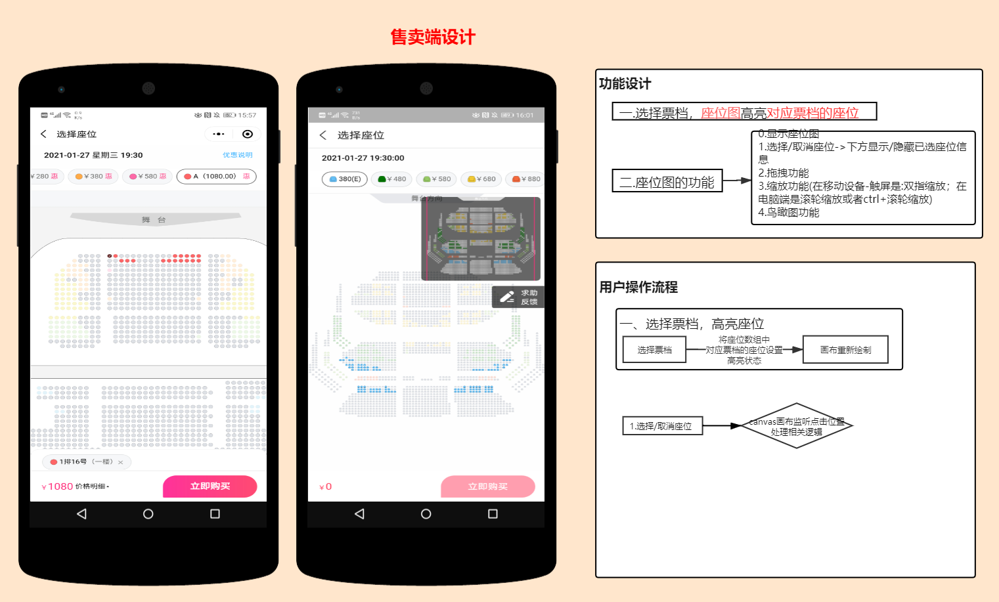

# 选座系统-设计思路

## [剧院选座系统设计][剧院选座系统设计]

### [一.场馆座位图设计][场馆座位图设计]

### [二.票图设计][票图设计]

### [三.售卖端设计][售卖端设计]

### 四.canvas绘图相关知识
|  效果 |  代码 |  
|-------|-------|
| [电影院座位][canvas-seat] |  [canvas-seat.html](../html/canvas/canvas-seat.html) |
| [时钟效果][canvas-clock] |   [canvas-clock.html](../html/canvas/canvas-clock.html) |
| [图片处理1][canvas-image1]	| [canvas-image1.html](../html/canvas/canvas-image1.html) |
| [图片处理2][canvas-image2]	|  [canvas-image2.html](../html/canvas/canvas-image2.html) |
| [鼠标交互1][canvas-mouse1]	| [canvas-mouse1.html](../html/canvas/canvas-mouse1.html) |
| [鼠标交互2][canvas-mouse2]	| [canvas-mouse2.html](../html/canvas/canvas-mouse2.html) |
| [antv-f2图表][antv-f2]	|    [antv-f2.html](../html/canvas/antv-f2.html)    |

[剧院选座系统设计]:https://www.processon.com/view/link/5ffeb605e0b34d2060d8bb79
[场馆座位图设计]:https://www.processon.com/view/link/5ffeb5d9f346fb55c5be5595
[票图设计]:https://www.processon.com/view/link/5ffeb62407912914e7e87e91
[售卖端设计]:https://www.processon.com/view/link/5ffead3fe401fd661a3c60c1

[antv-f2]:https://zhaoyj.work/canvas/antv-f2.html
[canvas-clock]:https://zhaoyj.work/canvas/canvas-clock.html
[canvas-image1]:https://zhaoyj.work/canvas/canvas-image1.html
[canvas-image2]:https://zhaoyj.work/canvas/canvas-image2.html
[canvas-mouse1]:https://zhaoyj.work/canvas/canvas-mouse1.html
[canvas-mouse2]:https://zhaoyj.work/canvas/canvas-mouse2.html
[canvas-seat]:https://zhaoyj.work/canvas/canvas-seat.html
