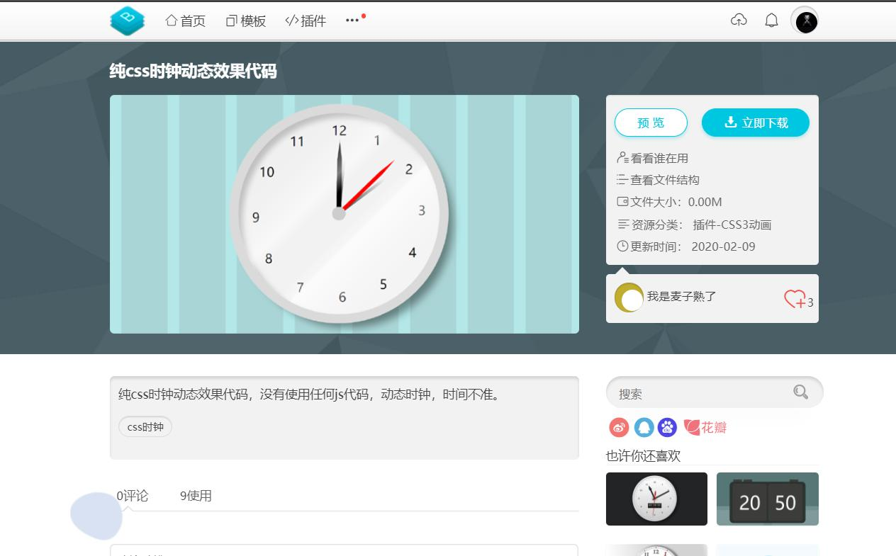
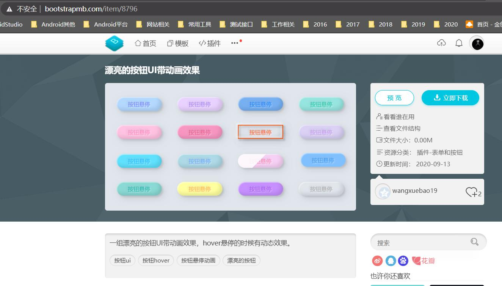
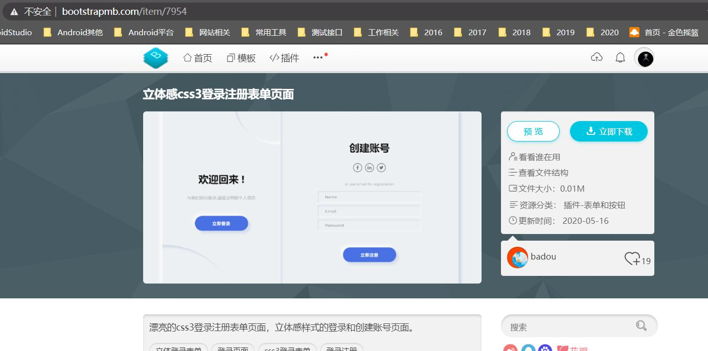
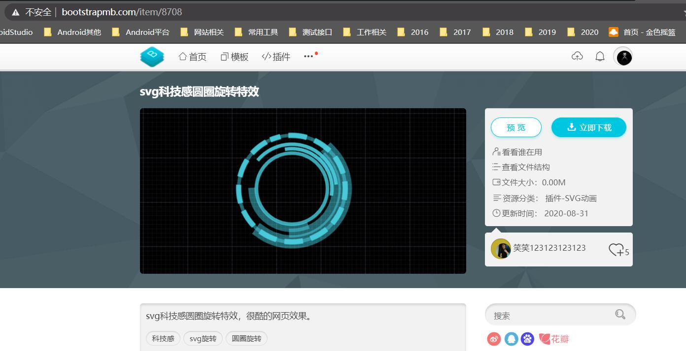
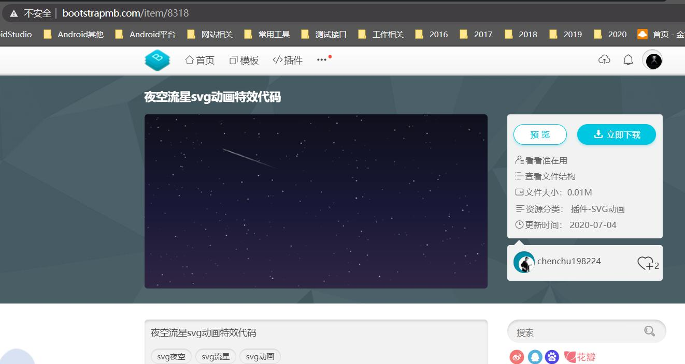
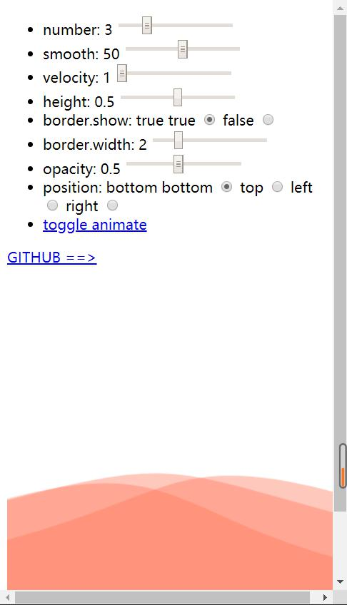
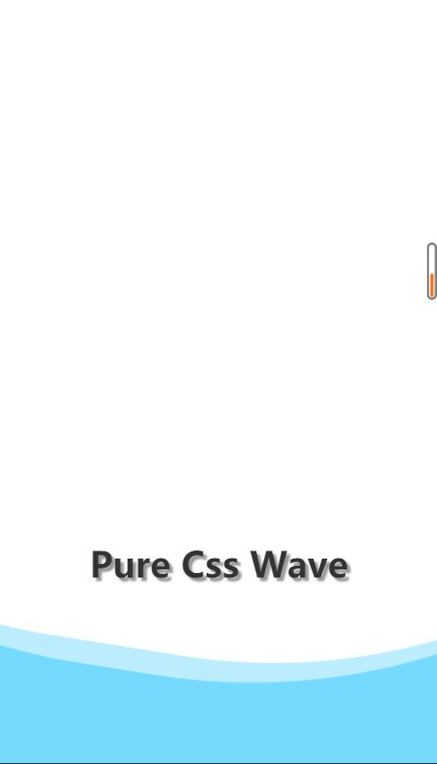

# html界面收集

>该目录大部分数据是使用[bootstrap模板网址的内容][bootstrapmb]

## 效果展示

[纯css时钟动态效果代码][clock]

[漂亮的按钮UI带动画效果][colorui-button]

[立体感css3登录注册表单页面][login]

[svg科技感圆圈旋转特效][svg-circle]

[夜空流星svg动画特效代码][svg-star]

[wave波浪效果1][wave1]

[wave波浪效果2][]

## 应用
在微信小程序等平台使用【wave波浪效果】-【svg】的过程：

[图片转base64][img=base64]
选择合适的svg内容，将svg转成base64数据，在界面中使用image标签引用base64数据即可。

[bootstrapmb]:http://www.bootstrapmb.com/
[clock]:http://www.bootstrapmb.com/item/7239
[colorui-button]:http://www.bootstrapmb.com/item/8796
[login]:http://www.bootstrapmb.com/item/7954
[svg-circle]:http://www.bootstrapmb.com/item/8708
[svg-star]:http://www.bootstrapmb.com/item/8318
[wave1]:https://github.com/QiShaoXuan/wavejs
[wave2]:https://github.com/QiShaoXuan/wavejs
[img=base64]:https://www.css-js.com/tools/base64.html
