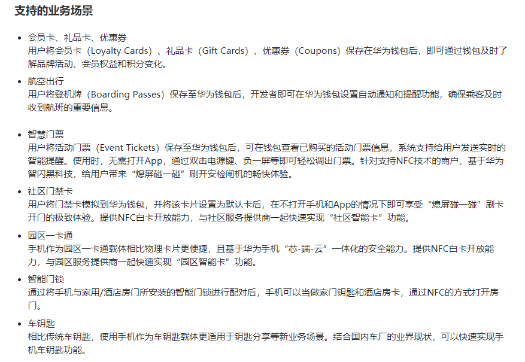

# 华为HMS使用

[TOC]

这应该是华为除了 `华为云`产品外，另一个重要的产品了，所以在官网的显目位置。至于 `鸿蒙系统` 也是刚出来不久，实际应用的很少。

使用感受：功能很多，但是都比较独立，很多项目的DEMO使用zip压缩包下载，部分是在[Github-HMS-Core][HMS-Core-Github]可以找到。所以实际使用的人应该也不多。

我只使用了 `推送服务`，`钱包服务`，`Media-图像服务`，`机器学习-人体模块` 以及 `HMS ToolKit插件`，其他功能还没有使用。

包含的能力：

1. **App Services**
   - [ ] [华为帐号服务](https://developer.huawei.com/consumer/cn/hms/huawei-accountkit)
   - [ ] [广告服务](https://developer.huawei.com/consumer/cn/hms/huawei-adskit)
   - [ ] [分析服务](https://developer.huawei.com/consumer/cn/hms/huawei-analyticskit)
   - [ ] [App Linking](https://developer.huawei.com/consumer/cn/agconnect/App-linking)
   - [ ] [情景感知服务](https://developer.huawei.com/consumer/cn/hms/huawei-awarenesskit)
   - [ ] [服务号](https://developer.huawei.com/consumer/cn/hms/huawei-businesstouchkit/)
   - [ ] [云空间服务](https://developer.huawei.com/consumer/cn/hms/huawei-drivekit)
   - [ ] [动态标签管理器服务](https://developer.huawei.com/consumer/cn/hms/huawei-dynamic-tag-manager)
   - [ ] [游戏服务](https://developer.huawei.com/consumer/cn/hms/huawei-game)
   - [ ] [运动健康服务](https://developer.huawei.com/consumer/cn/hms/huaweihealth/)
   - [ ] [用户身份服务](https://developer.huawei.com/consumer/cn/hms/huawei-identitykit)
   - [ ] [应用内支付服务](https://developer.huawei.com/consumer/cn/hms/huawei-iap/)
   - [ ] [定位服务](https://developer.huawei.com/consumer/cn/hms/huawei-locationkit)
   - [ ] [地图服务](https://developer.huawei.com/consumer/cn/hms/huawei-MapKit)
   - [x] [推送服务](https://developer.huawei.com/consumer/cn/hms/huawei-pushkit)
   - [ ] [快应用](https://developer.huawei.com/consumer/cn/quickApp)
   - [ ] [统一扫码服务](https://developer.huawei.com/consumer/cn/hms/huawei-scankit)
   - [ ] [搜索服务](https://developer.huawei.com/consumer/cn/hms/huawei-searchkit/)
   - [ ] [位置服务](https://developer.huawei.com/consumer/cn/hms/huawei-sitekit/)
   - [ ] [UI Engine](https://developer.huawei.com/consumer/cn/huawei-ui-kit/)
   - [x] [钱包服务](https://developer.huawei.com/consumer/cn/hms/huawei-walletkit/)
2. **Media**
   - [ ] [音频能力](https://developer.huawei.com/consumer/cn/audioengine)
   - [ ] [音频服务](https://developer.huawei.com/consumer/cn/hms/huawei-audiokit/)
   - [ ] [相机能力](https://developer.huawei.com/consumer/cn/CameraKit)
   - [x] [图像服务](https://developer.huawei.com/consumer/cn/hms/huawei-imagekit/)
   - [ ] [全景服务](https://developer.huawei.com/consumer/cn/hms/huawei-panoramakit)
   - [ ] [视频能力](https://developer.huawei.com/consumer/cn/hms/huawei-videoengine) *Beta*
   - [ ] [视频服务](https://developer.huawei.com/consumer/cn/hms/huawei-videokit/)
   - [ ] 数字版权服务
3. **Graphics**
   - [ ] [计算加速服务](https://developer.huawei.com/consumer/cn/hms/huawei-acceleratekit/)
   - [ ] [AR Engine](https://developer.huawei.com/consumer/cn/hms/huawei-arengine/)
   - [ ] [图形计算服务](https://developer.huawei.com/consumer/cn/hms/huawei-computer-graphics/)
   - [ ] [游戏加速能力](https://developer.huawei.com/consumer/cn/game-kit)
   - [ ] [图形引擎服务](https://developer.huawei.com/consumer/cn/hms/huawei-scenekit/)
   - [ ] [VR Engine](https://developer.huawei.com/consumer/cn/vr)
4. **Smart Device**
   - [ ] [畅连能力](https://developer.huawei.com/consumer/cn/caas-kit)
   - [ ] [投屏能力](https://developer.huawei.com/consumer/cn/cast-kit)
   - [ ] [设备虚拟化能力](https://developer.huawei.com/consumer/cn/device-virtualization)
   - [ ] [HUAWEI HiCar](https://developer.huawei.com/consumer/cn/HiCar)
   - [ ] [HUAWEI HiLink](https://developer.huawei.com/consumer/cn/smarthome)
   - [ ] [碰一碰能力](https://developer.huawei.com/consumer/cn/onehop-kit)
   - [ ] [手写笔能力](https://developer.huawei.com/consumer/cn/hms/huawei-pencilengine)
   - [ ] [文件分享能力](https://developer.huawei.com/consumer/cn/share-kit)
   - [ ] [穿戴能力](https://developer.huawei.com/consumer/cn/hms/huawei-wearengine)
5. **System**
   - [ ] [线性马达能力](https://developer.huawei.com/consumer/cn/haptics-kit)
   - [ ] [hQUIC Kit](https://developer.huawei.com/consumer/cn/hms/huawei-hQUIC/)
   - [ ] [双网聚合能力](https://developer.huawei.com/consumer/cn/link-turbo-kit)
   - [ ] [MDM能力](https://developer.huawei.com/consumer/cn/hms/right-sign)
   - [ ] [近距离通信服务](https://developer.huawei.com/consumer/cn/hms/huawei-nearbyservice)
   - [ ] [无线传输服务](https://developer.huawei.com/consumer/cn/hms/huawei-wirelesskit/)
6. **AI**
   - [x] [机器学习服务](https://developer.huawei.com/consumer/cn/hms/huawei-mlkit)
   - [ ] [HUAWEI HiAI Foundation](https://developer.huawei.com/consumer/cn/hiai#Foundation)
   - [ ] [HUAWEI HiAI Engine](https://developer.huawei.com/consumer/cn/hiai#Engine)
   - [ ] [HUAWEI HiAI Service](https://developer.huawei.com/consumer/cn/hiai#Service)

## 一、前置条件

需要华为手机安装 `Hms Core`软件。

在应用市场创建 `项目`-> `应用`，配置应用

在Android项目中依赖华为的 `HmsCore相关sdk`，然后在项目中就可以使用相关API实现相应功能。

> 至于 `agconnect sdk`是 `AppGallery Connect`即应用上线分发相关的功能。

## 二、Push Kit使用

*项目地址：[testhms-demo][testhms-demo]*

**使用过程：**

1. 在[华为开发者网站][huawei-agc-pc] `项目-应用`管理界面 > `项目设置` > `API管理` 将 `Push Kit`开关打开。

2. 在Android项目中添加sdk依赖：

   ```
   implementation 'com.huawei.hms:push:5.0.4.302'
   ```

3. 在Android项目中添加相应推送代码（可以使用`HMS ToolKit` > `Coding Assistant` > `拖拽代码到项目` 方式添加 ）

   

   > 第一步：找到 `Coding Assistant` > `App Services` > `Push Kit`

   

   > 第二步：在 `Push Kit` > ` Scenarios List(情景列表)` > `Send nofification message...(发送通知消息)` > `将该项拖到编辑器中`

4. 运行Android项目，进入`PushGetTokenActivity界面` > 点击`GetToken按钮 `获取Token

5. 在[华为开发者网站][huawei-agc-pc]发送推送进行测试，填入刚才获取到的token。正常在手机上就可以收到推送通知。


> 推送通知效果

## 三、HUAWEI Wallet Kit使用

*项目地址：[testhms-demo]*  

[官方DEMO][huawei-wallet-demo]：

1. 客户端DEMO作用：提供以下两种方式添加卡券到华为钱包：**都下方服务器端的配合**
   - 方式一：通过`卡券包`方式向华为钱包推送卡券，需要相应服务端Demo配合（*`？？里面有许多按钮不知道是什么意思？？`*）。
   - 方式二：通过`JWE`方式向华为钱包推送卡券，需要相应服务端Demo配合。
2. 服务端DEMO功能：
   1. `JWE`示例代码（1.在华为钱包生成卡券模板。2.使用卡券模板及其他参数生成`JWE`网址链接<用户打开连接登陆华为账号，就可以添加卡券到钱包>）
   2. `PassSDK`示例代码（卡券包生成）
   3. `NFC`刷卡能力示例代码（华为钱包的卡券激活NFC能力时，需要此DEMO配合）

**大致流程：**

> 前置条件：在[华为开发者网站][huawei-agc-pc] `需要打开应用的Wallet Kit API开关` > `配置华为钱包-WalletKit服务`

* `卡券包`方式添加：`需要服务端JWE示例代码先【生成卡券模板】` > `通过服务端代码生成JWE网址链接添加卡券到钱包`或者 `通过客户端SDK添加JWE卡券到钱包`
* `PassObject`卡券包方式添加：`需要服务端PassSDK示例代码先生成卡券包` > `通过客户端SDK添加PassObject卡券到钱包`
* 在 `华为钱包` 激活卡券`NFC功能`：`需要使用服务端NFC刷卡示例代码部署服务到自己的服务器` > `需要上面【生成卡券模板】的时候就标识NFC功能及自己服务器NFC服务地址`（*`？？以上操作我都完成了，最后激活的时候还是失败，没有错误信息。工单沟通很费劲，最后提供了一个微信号：【m6613momo】。我没有精力再去尝试了，感兴趣的可以去联系寻求帮助。？？`*）




> 看官方的介绍`Wallet Kit`支持的业务场景还是很强大的，我们公司调研也想实现 `智慧门票` 的效果，但是失败了。

**使用总结：**

- 功能实现比较复杂、文档不是很全

- `智慧门票` 只实现了将卡片添加到华为钱包的效果，并没有什么卵用（因为我们需要让卡片具有NFC功能，这样才能实现熄屏刷门票卡的功能）

  ​      **其他非 `nfc`的场景应该可以满足：**

  - [地理围栏通知](https://developer.huawei.com/consumer/cn/doc/development/HMSCore-Guides/access_membership-0000001050044329#ZH-CN_TOPIC_0000001050157140__section29035311618) ：用户到达商户地理围栏附近时弹出通知栏提醒用户。
  - [活动开始前通知](https://developer.huawei.com/consumer/cn/doc/development/HMSCore-Guides/access-eventticket-0000001050042382#ZH-CN_TOPIC_0000001050159095__section39371878515) ：活动开始前提醒用户。
  - [起飞提醒通知](https://developer.huawei.com/consumer/cn/doc/development/HMSCore-Guides/access-flight-0000001050044333#ZH-CN_TOPIC_0000001050157144__section2016999131) ：航班起飞前提醒用户。
  - [登机口变更通知](https://developer.huawei.com/consumer/cn/doc/development/HMSCore-Guides/access-flight-0000001050044333#ZH-CN_TOPIC_0000001050157144__section1936915571026) ：航班登机口变更时提醒用户。
  - 二维码、条形码核验。

- 提交工单、客服沟通体验不好。

**使用过程：**

1. 在[华为开发者网站][huawei-agc-pc] `项目-应用`管理界面 > `项目设置` > `API管理` 将 `Wallet Kit`开关打开。
2. 在[华为开发者网站] `华为钱包` > `申请WalletKit服务` >  得到：`passTypeIdentifier：服务号`、`servicePrivateKey：服务私钥`
3. 使用服务端`JWE`示例代码及上面得到的参数生成卡券模板及`JWE`网址链接
4. 打开`JWE`网址链接添加卡券到华为钱包。（使用`APP`添加`JWE`卡券的特点就是免登陆）


> 最终效果

## 四、Media-图像服务使用

**[官方DEMO][huawei-image-demo]**

**`场景智能设计DEMO`中 包含的功能有：**

1. filter：图片滤镜

2. smartlayout：为图片添加文字布局

3. themetag：获取图片主题信息

4. sticker：为图片添加贴纸

5. crop：图片裁剪功能

   <div>
       <div style="display:flex">
           
           
           
           
           
   	</div>
       <div style="display:flex;position:absolute;top:70%;color:red;font-weight:bold;width:100%">
           <text style="width:15%;text-align:center">图片滤镜</text>
           <text style="width:17%;text-align:center">添加文字布局</text>
           <text style="width:15%;text-align:center">获取图片主题</text>
           <text style="width:17%;text-align:center">为图片添加贴纸</text>
           <text style="width:17%;text-align:center">图片裁剪功能</text>
       </div>
   </div>

## 五、机器学习服务使用

**[官方DEMO][huawewi-ml-demo]**

下面是该模块下的所有内容，感觉都挺不错的所以都列出来，有兴趣的可以去试试。

1. 文本模块： [ 文本识别](https://developer.huawei.com/consumer/cn/doc/development/HMSCore-Guides/text-recognition-0000001050040053) 、[文档识别](https://developer.huawei.com/consumer/cn/doc/development/HMSCore-Guides/document-recognition-0000001050038108) 、  [身份证识别](https://developer.huawei.com/consumer/cn/doc/development/HMSCore-Guides/idcard-recognition-0000001050040063) 、  [银行卡识别](https://developer.huawei.com/consumer/cn/doc/development/HMSCore-Guides/bank-card-recognition-0000001050038118) 、[通用卡证识别](https://developer.huawei.com/consumer/cn/doc/development/HMSCore-Guides/general-card-recognition-0000001050040073) 、[表格识别](https://developer.huawei.com/consumer/cn/doc/development/HMSCore-Guides/form-recognition-0000001058920154)
2. 视觉模块：  文本翻译 、语种检测  、[实时语音识别](https://developer.huawei.com/consumer/cn/doc/development/HMSCore-Guides/ml-asr-0000001050066212) 、语音合成 、[音频文件转写](https://developer.huawei.com/consumer/cn/doc/development/HMSCore-Guides/audio-file-transcription-0000001050040089) 、[个性化讲解视频生成](https://developer.huawei.com/consumer/cn/doc/development/HMSCore-Guides/video-course-creator-0000001051266263) 、[实时语音转写](https://developer.huawei.com/consumer/cn/doc/development/HMSCore-Guides/real-time-transcription-0000001054964200)  、[声音识别](https://developer.huawei.com/consumer/cn/doc/development/HMSCore-Guides/sound-detection-0000001055282786) 
3. 图像模块：  [ 图片分类](https://developer.huawei.com/consumer/cn/doc/development/HMSCore-Guides/image-classification-0000001050040095) 、[对象检测与跟踪](https://developer.huawei.com/consumer/cn/doc/development/HMSCore-Guides/object-detection-track-0000001050038150) 、[地标识别](https://developer.huawei.com/consumer/cn/doc/development/HMSCore-Guides/landmark-recognition-0000001050038154) 、[图像分割](https://developer.huawei.com/consumer/cn/doc/development/HMSCore-Guides/image-segmentation-0000001050040109) 、[拍照购物](https://developer.huawei.com/consumer/cn/doc/development/HMSCore-Guides/product-visual-search-0000001050038164) 、[图像超分辨率](https://developer.huawei.com/consumer/cn/doc/development/HMSCore-Guides/imagesuper-resolution-0000001051546182) 、[文档校正](https://developer.huawei.com/consumer/cn/doc/development/HMSCore-Guides/documentskewcorrection-0000001051703156) 、[文字图像超分辨率](https://developer.huawei.com/consumer/cn/doc/development/HMSCore-Guides/text-image-super-resolution-0000001055442768) 、[场景识别](https://developer.huawei.com/consumer/cn/doc/development/HMSCore-Guides/scene-detection-0000001055162807)
4. 人体模块：  [ 人脸检测](https://developer.huawei.com/consumer/cn/doc/development/HMSCore-Guides/face-detection-0000001050038170) 、[人体骨骼检测](https://developer.huawei.com/consumer/cn/doc/development/HMSCore-Guides/skeleton-detection-0000001051008415) 、[活体检测](https://developer.huawei.com/consumer/cn/doc/development/HMSCore-Guides/liveness-detection-0000001051386243) 、[手势识别](https://developer.huawei.com/consumer/cn/doc/development/HMSCore-Guides/handgesturerecognition-0000001051615541)、[人脸比对](https://developer.huawei.com/consumer/cn/doc/development/HMSCore-Guides/faceverification-0000001071919926)
5. 自然语言处理类服务开发...
6. 自定义模型...

我只试了DEMO里的`MLKit-Sample[基础功能]`的功能，`ApplicationCases[应用场景]`的功能没有测试。因为`gradle`版本必须是 `6.5`，下载太慢了就没有实际去看，看效果图还是很不错的。

**一、`MLKit-Sample`里面的各模块界面**

<div>
    <div style="display:flex">
        
        
        
        
	</div>
    <div style="display:flex;position:absolute;top:70%;color:red;font-weight:bold;width:100%">
        <text style="width:23%;text-align:center">module-body</text>
        <text style="width:20%;text-align:center">module-text</text>
        <text style="width:25%;text-align:center">module-vision</text>
        <text style="width:22%;text-align:center">module-custom</text>
    </div>
</div>

> module-body模块功能
>
> <div>
>     <div style="display:flex">
>         
>         
>         
>         
>         
> 	</div>
>     <div style="display:flex;position:absolute;top:70%;color:red;font-weight:bold;width:100%">
>         <text style="width:20%;text-align:center">人脸检测</text>
>         <text style="width:18%;text-align:center">人体骨骼检测</text>
>         <text style="width:15%;text-align:center">手势识别</text>
>          <text style="width:20%;text-align:center">手势识别</text>
>         <text style="width:20%;text-align:center">人脸比对</text>
>     </div>
> </div>

> module-text模块功能
>
> <div>
>     <div style="display:flex">
>         
>         
>         
>         
>         
> 	</div>
>     <div style="display:flex;position:absolute;top:70%;color:red;font-weight:bold;width:100%">
>         <text style="width:20%;text-align:center">实时语音识别</text>
>         <text style="width:18%;text-align:center">语音合成</text>
>         <text style="width:20%;text-align:center">实时语音转写</text>
>          <text style="width:20%;text-align:center">银行卡识别</text>
>         <text style="width:20%;text-align:center">文本翻译</text>
>     </div>
> </div>

**二、`ApplicationCases`里的各应用场景**

<div>
    <div style="display:flex">
        
        
        
        
        
        
	</div>
    <div style="display:flex;position:absolute;top:70%;color:red;font-weight:bold;width:100%">
        <text style="width:14%;text-align:center">CrazyRockets</text>
        <text style="width:14%;text-align:center">CrazyRockets</text>
        <text style="width:10%;text-align:center">CrazyShoppingCart</text>
        <text style="width:15%;text-align:center">Gesture-Change-Background</text>
        <text style="width:12%;text-align:center">ID-Photo-DIY</text>
        <text style="width:10%;text-align:center">Photo-Translate</text>
    </div>
</div>

## 六、HMS ToolKit使用

**[HMS-Toolkit安装使用][HMS-Toolkit]**

主要功能请参考文档使用

感觉很不错的**[云真机测试功能][HMS-Toolkit-Cloud-Debugging]**，大家可以体验一下。

> Cloud Debugging功能每次使用的单设备使用时长为2小时，到期前，您可以先释放设备资源，然后再重新申请该设备即可。第一次使用时，HMS Toolkit会为用户分配24小时的Cloud Debugging时长，到期后系统会自动提醒用户是否续申请，一次可以续申请8小时。请开发者合理高效的利用设备资源，及时释放空闲的设备。


## 七、其他开放能力使用

**[桌面角标](https://developer.huawei.com/consumer/cn/hms/desk-top-corner)**


[HMS-Core-Github]: https://github.com/HMS-Core
[huawei-agc-pc]: https://developer.huawei.com/consumer/cn/service/josp/agc/index.html
[testhms-demo]: https://github.com/yueyue10/hms-wallet-clientdemo-android
[huawei-wallet-demo]: https://developer.huawei.com/consumer/cn/doc/development/HMSCore-Examples-V5/android-sample-code-0000001050159395-V5
[huawei-image-demo]: https://developer.huawei.com/consumer/cn/doc/development/HMSCore-Examples-V5/sample-code-0000001050199421-V5
[huawewi-ml-demo]: https://github.com/HMS-Core/hms-ml-demo
[HMS-Toolkit]: https://developer.huawei.com/consumer/cn/doc/development/Tools-Guides/installation-0000001050145206
[HMS-Toolkit-Cloud-Debugging]: https://developer.huawei.com/consumer/cn/doc/development/Tools-Guides/cloud-debugging-0000001051084360

