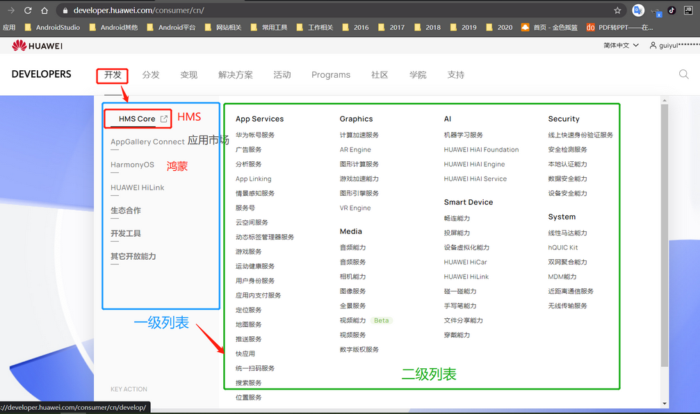

# 华为开发者能力

[TOC]

## 一、华为开发者联盟

​																					[**华为开发者联盟官网**][huawei_developer]

> 官网的功能主要在 `开发`，`学院`，`支持`模块中。

这些模块中都是下面的这几个能力相关的内容：

* 从 `开发`中点击进入了每个能力的详细介绍页面，然后可以进入文档介绍页面。
* 从 `学院`中进入可以浏览各能力的视频学习内容。
* 从 `支持`中进入可以查看各能力的文档介绍，也可以客服交流、提交工单等。

### 一、HMS Core（[HMS能力][./华为hms.md]）

需要华为手机上安装 `HmsCore`应用，然后就可以在自己的App内集成 `HmsCore`的sdk并使用相关功能。

### 二、AppGallery （应用市场）

华为应用市场的管理，可以上传应用，发布应用，更新应用等。

### 三、HarmonyOS （鸿蒙系统）

鸿蒙系统是一套新的硬件系统，目标是人工智能行业的硬件设备。

### 四、HUAWEI HiLink

HUAWEI HiLink 智能硬件生态，使用两种方式接入：1.硬件使用HiLink的WiFi模组接入，2.基于OAuth 2.0的帐号绑定授权能力接入。

- 连入同一网络时，会被华为手机和平板的EMUI系统自动发现

- 可以在EMUI负一屏管理设备

- 可实现小艺语音控制

- 与其他HiLink产品联动 

### 五、生态合作 （DFH）

为华为智能手机、平板/笔记本电脑、可穿戴设备等配件开发。

### 六、开发工具

包括 `快应用IDE`，`Theme Studio`，`HMS Toolkit`等，可以开发华为快应用，华为主题，华为Hms应用等。

### 七、其他开放能力

包括 `3D内容平台`，`AR创新平台`，`桌面角标`，`HiRLD`等。提供了一个3D、AR内容分享平台，以及可以修改华为手机桌面图标的能力，自适应布局控件SDK能力等。

## 二、华为云开发者

​																				  [**华为云开发者官网**][huawei_yun]

[huawei_developer]: https://developer.huawei.com/consumer/cn/
[huawei_yun]: https://developer.huaweicloud.com/
