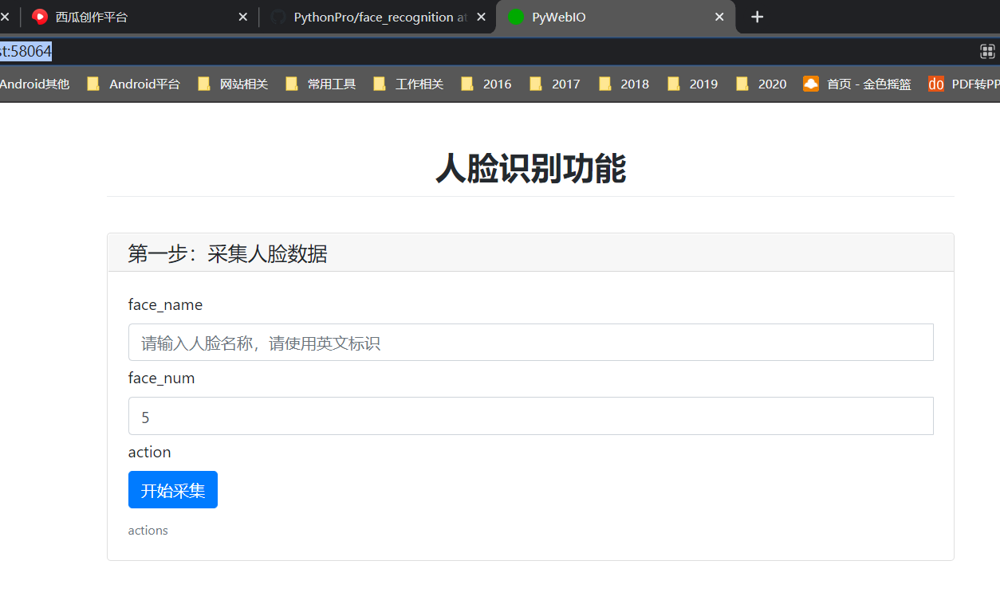
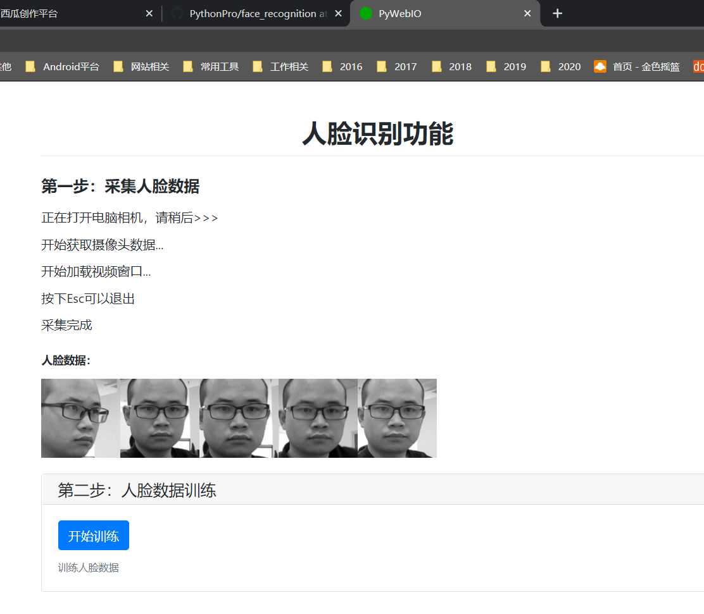
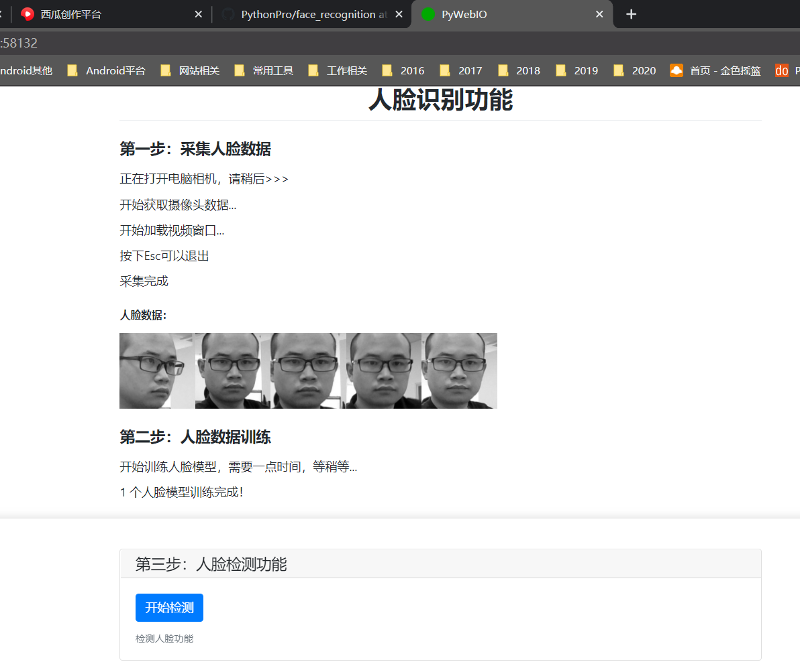
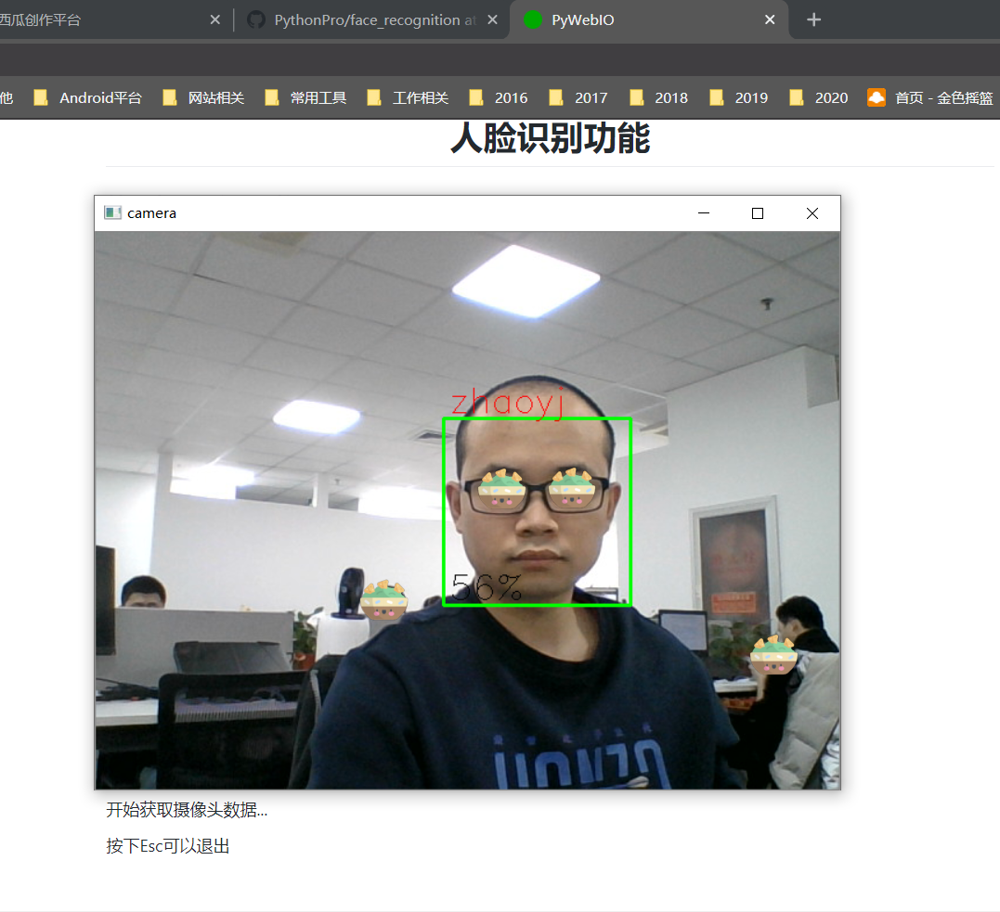

# 使用Python-Opencv实现人脸识别功能

相关文档
* [**Python-cv2用法**][Python-cv2]
* [**此文档介绍的Opencv项目地址**][face_recognition]
* [OpenCV-Face-Recognition-文章][OpenCV-Face-Recognition-Blog]
* [_OpenCV-Face-Recognition-GitHub_][OpenCV-Face-Recognition-GitHub]
* [_基于Python3.7和opencv的人脸识别_][基于Python3.7和opencv的人脸识别]

> 项目简介
1. 之前写的一个测试程序使用上面的[`OpenCV-Face-Recognition`][OpenCV-Face-Recognition-Blog]文章代码可以实现人脸识别功能
2. 自创建`PythonPro`这个多项目目录后，一直想着把这个功能加进来
3. 正好赶上现在不忙同时能力提高到可以重构之前写的程序，所以就重构了之前的代码
4. 加入刚接触的`PyWebIO`库为功能添加界面，做成一个应用

_实际效果_





> 实现过程
1. 主要有两个过程：`人脸数据收集`、`人脸模型训练`
2. 有了上面两个过程就可以使用`人脸识别`程序进行识别
3. 所有人脸识别功能都是使用`OpenCV`库以及文章代码实现
4. 在原有人脸识别代码基础上进行优化，包括：
    >整体数据统一：`CascadeClassifier`加载的文件路径、人脸图片保存路径、训练文件保存路径统一使用`Config`类里面的属性
    
    >人脸数据采集优化：保存图片过程增加等待时间(用户可以变换脸部姿势),增加提示信息。对保存的图片增加`face_name`标识人脸信息，`face_id`更方便理解使用。保存后的图片名称为：`face_name.face_id.num.jpg`
    
    > 人脸训练过程优化：直接将上面的人脸图片数据及`face_id`对应并进行训练
    
    > 人脸识别过程优化：在`Config`类里面可以`get_face_dict`方法可以得到`{face_id:face_name}`字典，将识别结果的`face_id`就可以转换成`face_name`标识

5. 使用`PyWebIO`作为应用界面之后,里面的一些`优秀代码`
    > 给`scope`添加`style`样式，上个项目没有找到这个`put_html()方法添加<style>标签`的代码，这次终于找到了
    ```
    # 实现loading控件和loading文本在父布局的中间显示
    with use_scope('loading'):                                                   
        put_loading(color="primary")                                             
        put_text("加载中...")                                                       
        put_html("""<style>#pywebio-scope-loading {text-align:center}</style>""")
    ```
    > 实现类似js里面的setTimeOut()功能，一定时间后执行相关逻辑而不影响主进程功能
    ```
    # 1.实现一定时间后隐藏loading框，而不影响主进程的执行
    timer = threading.Timer(timeout, self.hide_loading)
    timer.start()
    # 2.实现一定时间后追加【text】文本到页面，而不影响主进程的执行
    def put_text_delay(self, text, timeout=2):
        timer = threading.Timer(timeout, self.put_text, [text])
        timer.start()
    ```
    > 关于`numpy.ndarray`的理解
    ```
    是对多维数组的封装，在图像数据操作过程中更方便使用。例如可以直接获取数组的维度。。。
    ```

## 项目中具体实现
直接运行【demo】目录下的`main.py`程序即可查看效果。

* 使用`PyWebIO`的`input_group`方法阻塞进程，来获取用户输入的`face_name`和`face_num`值以及点击`开始收集数据`的监听，执行人脸数据采集程序。
    ```
    coll_info = input_group('第一步：采集人脸数据', [                                                                  
        input('face_name', type=TEXT, name='face_name', required=True, placeholder="请输入人脸名称，请使用英文标识"),       
        input('face_num', type=NUMBER, name='face_num', required=True, placeholder="请输入采集人脸数量", value=5),    
        actions('action', [                                     
            {'label': '开始采集', 'value': 'start'}                                                              
        ], name='action', help_text='actions'),                                                              
    ])
    if coll_info['action'] == 'start':                             
        self.collect(coll_info['face_num'], coll_info['face_name'])
        confirm = actions('第二步：人脸数据训练', ['开始训练'], help_text='训练人脸数据')                                                                                       
    ```
* 使用`PyWebIO`的`actions`方法阻塞进程，实现用户点击`开始训练数据`、`开始人脸识别`的监听，执行相应的程序。
    ```
    confirm = actions('第二步：人脸数据训练', ['开始训练'], help_text='训练人脸数据')
    if confirm == '开始训练':
        self.training()
    ```
* 使用`put_text_delay`方法延迟添加文本到界面实现程序执行中的效果
    ```
    self.put_text_delay("正在打开电脑相机，请稍后>>>")
    ```
* 使用`show_loading`方法显示`loading`提示框并在一定时候后隐藏，实现加载视频窗口效果
    ```
    def show_loading(self, timeout=5):
        print('show_loading------------')
        with use_scope('loading'):
            put_loading(color="primary")
            put_text("加载中...")
            put_html("""<style>#pywebio-scope-loading {text-align:center}</style>""")
        timer = threading.Timer(timeout, self.hide_loading)
        timer.start()
    ```
* 在采集数据过程中，人脸图片需要一直持续绘制中，这样感觉程序运行稳定不卡。
但是还要实现图片延迟保存的效果，所以就想到在`while`循环中加入`timer`:
    ```
    1.在while循环中识别到人脸数量为1的时候保存图片并启动timer，设置time_cache、can_save的值，下次进入判断can_save的值为False不执行保存图片。
    2.在while循环中执行timer，判断当前时间和timer启动时间大于3s就重置time_cache及can_save值
    ```
    所以保存图片的过程通过`timer`里面的判断当前时间和`time_cache`时间差为3s实现，保存过程中持续绘制相机图片，只是提示正在保存图片并等待3s后可以继续保存。
    
    部分代码：
    ```
    def save_user_pictures(self, total_count=10):
        while True:
            # 从摄像头读取图片
            success, img = self.cap.read()
            ...self.draw_rect(img, faces, gray)
                ...self.save_pics(faces, gray)
                    ...self.timer(start=True)
            self.timer()
            cv2.imshow('人脸数据收集', img)
    def timer(self, start=False):
        cur_time = int(time.time())
        print("cur_time", cur_time)
        if self.time_cache and cur_time - self.time_cache >= 3:
            self.time_cache = None
            self.can_save = True
        elif start:
            self.time_cache = cur_time
            self.can_save = False
    ```
* 使用`cv2.putText()`方法显示提示文字信息，因为不支持中文文字，所以用英文代替
    ```
    cv2.putText(img, "saving {} picture".format(self.pic_count), (conf.h_wid - 50, conf.h_hei),cv2.FONT_HERSHEY_SIMPLEX, 0.8, (208, 2, 27), 1)
    ```
* 判断点击`esc`按键或者保存数据等于要保存的图片数量就退出`保存人脸图片程序`并销毁cv2相关资源
    ```
    k = cv2.waitKey(1)
    if k == 27:  # 通过esc键退出摄像
        break
    elif self.pic_count >= total_count:  # 得到1000个样本后退出摄像
        break
    ```
* 结束人脸数据采集程序后，使用`put_image()`方法在页面显示人脸图片数据
    ```
    put_image(face_img, width='100px')
    ```
* 用户点击`开始训练数据`按钮后，执行人脸数据训练相应逻辑
    ```
    def training(self):
        self.put_title('第二步：人脸数据训练')
        ...
    ```
* 用户点击`开始人脸识别`按钮后，执行人脸识别相应逻辑
    ```
    def recognition(self):
        self.put_title('第三步：人脸检测功能')
        ...
    ```
* 具体人脸数据逻辑:
    > 在`Config`类里面定义`face_path`人脸数据保存路径、`train_path`训练数据保存路径。提供获取人脸数据方法：`get_face_images`、获取人脸id-name对应方法`get_face_dict`。
    
    > 数据采集过程中将图片保存到`face_path`路径下，格式为`face_name.face_id.num.jpg`
    
    > 数据训练过程中`face_path`下人脸图片数据，根据文件名获取到`face_id`。通过图片数据和face_id训练人脸数据模型保存到`train_path`数据模型目录下。
    
    > 人脸识别过程中，通过`train_path`下数据模型数据进行匹配识别，将识别到的`face_id`转换成`face_name`显示出来即可。


[Python-cv2]:https://www.cnblogs.com/shizhengwen/p/8719062.html
[基于Python3.7和opencv的人脸识别]:https://www.cnblogs.com/xp12345/p/9818435.html
[OpenCV-Face-Recognition-GitHub]:https://github.com/Mjrovai/OpenCV-Face-Recognition
[OpenCV-Face-Recognition-Blog]:https://shumeipai.nxez.com/2018/03/09/real-time-face-recognition-an-end-to-end-project-with-raspberry-pi.html
[face_recognition]:https://github.com/yueyue10/PythonPro/tree/master/face_recognition

