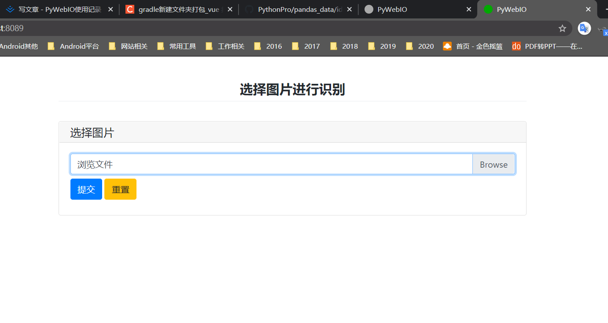
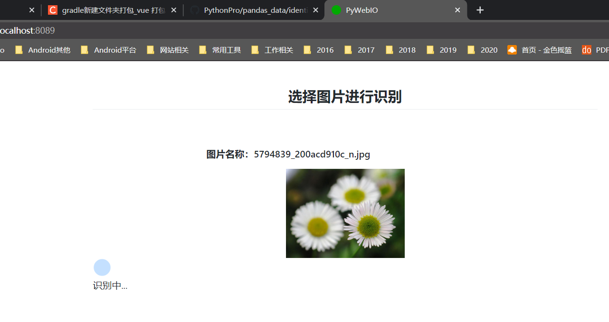
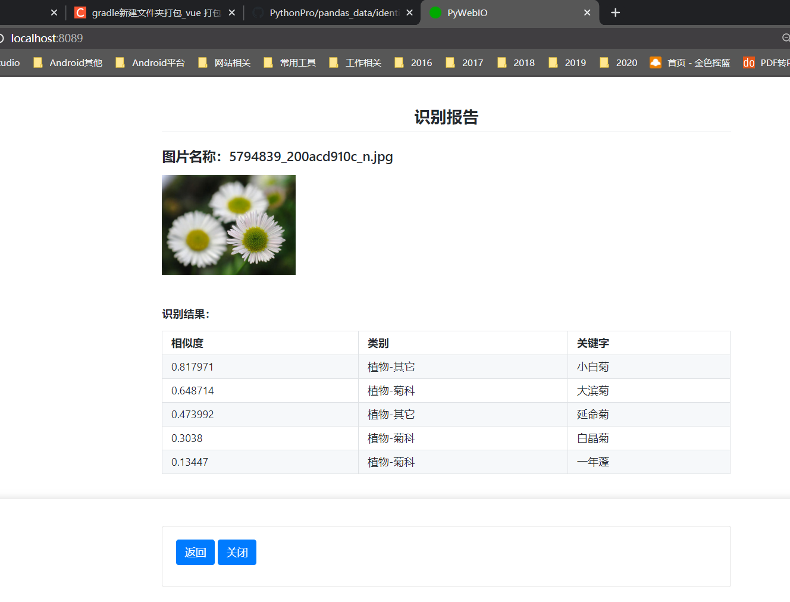

# [`PyWebIO`][PyWebIO]使用记录

相关文档
* [PyWebIO官方文档][PyWebIO]
* [PyWebIO-Demos][PyWebIO-demos]
* [此文档介绍的PyWebIO项目地址][baidu-identify]

🎯[**项目视频1**][xigua1]🎞

🎯[**项目视频2**][xigua2]🎞

> 项目简介

1. 之前写的一个测试程序使用百度识图API`识别图片信息`
2. 看到`PyWebIO`之后看着效果很好，就想着试着用一下。    
3. 加入`PyWebIO`之后的功能为(这样做到了应用的界面可视化)：
   * 在浏览器：用户可以选择电脑上要识别的图片
   * 调用百度图片识别API
   * 在浏览器：将图片识别结果直观的展示出来

_最终的效果是这样的：_




**`PyWebIO`介绍**
* 对于单个`Python应用`，使用`PyWebIO`可以很方便的制作应用的界面及交互。_之前一直想使用Python做一个应用交互界面,终于可以实现了。_
* 使用`PyWebIO`还可以和`Django`等服务端框架配合，输出一些数据可视化的网页能力。
* 因为`PyWebIO`使用浏览器作为数据输入和输出的工具，所以对不同浏览器应该有适配的问题。

**和`Html`网页的区别**
* `PyWebIO`就是对`Html`的封装，提供给`Python`调用。Python的优点就是：简单，方便，所以很方便的可以使用Html功能。
* 用`Html`+`js`也可以实现应用的功能，代码可能多一点而已。页面框架的话可以使用`BootStarp`等。
* 所以：功能都可以实现，一种就是`Python程序`(也可以打包成exe程序)，另一种就是`Html文件`。
如果将应用部署到服务器的话，就可以使用浏览器直接访问网址体验应用效果(这时候两者就保持了统一)。

## 项目中使用流程

### 1.`pywebio`使用
* 使用`file_upload`方法上传图片
    ```
    img = file_upload("选择图片", accept="image/*", placeholder="浏览文件", required=True)
    ```
* 使用`put_image`方法将`图片base64`数据展示出来
    ```
    img_bs = img['dataurl']
    put_image(img_bs, width='200px')
    ```
* 使用`use_scope - clear()`实现显示`loading`及隐藏效果
    ```
    with use_scope('pre-layout'):
        put_loading(shape='grow', color='primary')
        table_res = analysis(img_bs)
        time.sleep(3)
        clear()
    ```
* 使用`put_table`方法展示图片识别结果
    ```
    put_table(table_res)
    ```
* 使用`actions`实现按钮阻塞程序，等待用户点击后执行相应操作。用户点击【返回】再次进入程序入口。
    ```
    confirm = actions('', ['返回', '关闭'], help_text='')
    if confirm == '返回':
        start()
    ```
* 在程序中直接使用`pywebio`功能,可以直接执行代码中`start()`方法即可。

### 2.`Python`应用程序打包`exe`应用
* 使用`pip3`安装`pyinstaller`库
* 使用`start_server`方法使程序具有启动`web服务`的功能，否则打开`exe`应用后不可用。
    ```
    server = start_server(start, port=8089, auto_open_webbrowser=True, debug=True)
    ```  
* 使用`pyinstaller -F baidu.py`命令就可以打包`exe`应用，打开`exe`程序同样报错。
需要添加[pywebio.html][pywebio.html]到刚才生成的`build/baidu/`目录下。
    * 这个`pywebio.html`文件是在启动本地Python应用程序后，在网页的网络请求中获取到的`基础Html`。
    可以理解为`pywebio`的功能是在`基础html`上通过js实现的。
    * 关于这个问题可以查看`pywebio`库在github的issue里面的第二个内容。
* 再次运行`pyinstaller -F baidu.py`命令后，打开`exe`应用程序后功能正常。

### 3.自己生成`exe`程序的`ico`图标
* 在[iconfont][iconfont]或其他网站获取一个喜欢的图片
* 在[bitbug][bitbug]网站将图片转换成`icon`图标，并且设置成`16*16`尺寸的。
* 将上面生成的`ico`图标放到要打包的`python`程序的目录
* 打包`exe`程序时，使用`pyinstaller -F -i xxx.ico baidu.py`就可以设置`exe`程序的图标了
效果是这样滴：


[bitbug]:http://www.bitbug.net/
[iconfont]:https://www.iconfont.cn/
[PyWebIO]:https://pywebio.readthedocs.io/zh_CN/latest/index.html
[PyWebIO-demos]:http://pywebio-demos.demo.wangweimin.site/
[baidu-identify]:https://github.com/yueyue10/PythonPro/tree/master/pandas_data/identify
[pywebio.html]:https://github.com/yueyue10/PythonPro/tree/master/pandas_data/identify/pywebio.html
[xigua1]:https://www.ixigua.com/6925352459384652302?logTag=A8Odb5Mx2Yz7j1fIKMRsQ
[xigua2]:https://www.ixigua.com/6925351483990868494?logTag=ovsEuNC6n3zr7qMRpmYqA
