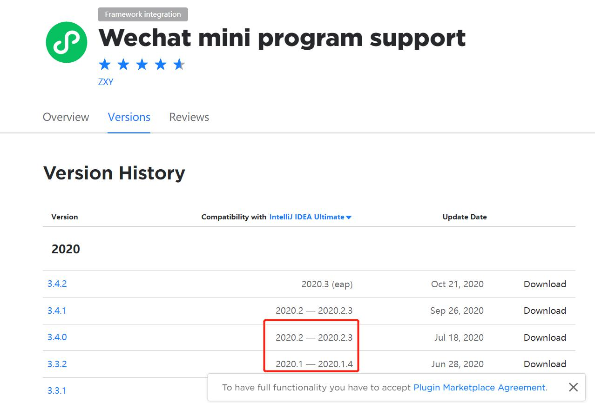
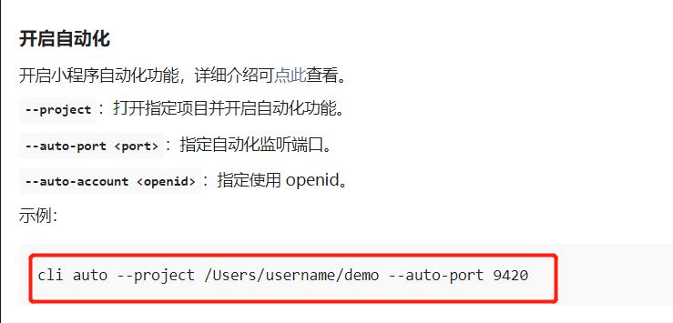
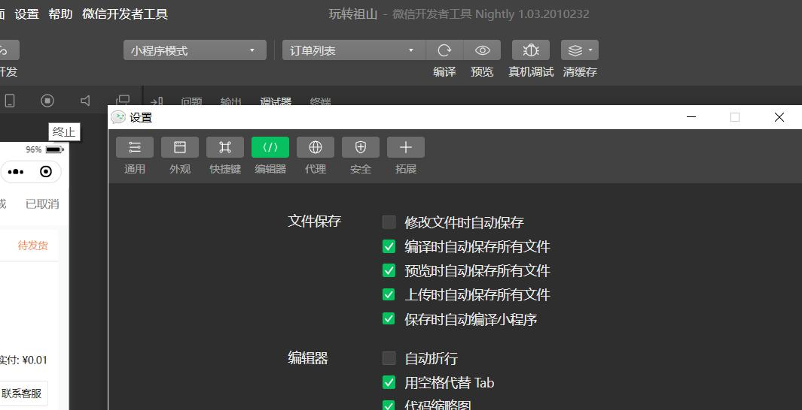

# 使用【IntelliJ IDEA】开发微信小程序经历，真的太爽了

### 一、使用流程

#### 1.Idea插件的下载

[插件介绍][wechat-plugin1]
方便的地方主要是：微信小程序文件的支持，代码格式化，布局-css-js的跳转，等

[插件官网][wechat-plugin]

这里提示可用的idea的版本基本都在2020的以上，所以需要下载一个最新的idea版本

#### 2.IDEA2020.2.3开发工具下载
[IDEA2020破解方法][idea2020]
破解之后我删除了桌面的文件也是可用的

**安装后将上面的插件安装上。**

#### 3.使用IDEA开发微信小程序
使用IDEA打开微信小程序项目，就可以使用IDEA编辑文件。

#### 4.使用IDEA运行小程序项目到微信开发者工具进行预览、调试
[命令行运行微信开发者工具-官网介绍][wechat-tools-cli]


在IDEA的【Termial】命令窗口输入如下命令，开启微信开发者工具的自动化功能。
```
cli auto --project [小程序项目目录]  --auto port  9420 
```
#### 5.编辑项目中的文件后，切换到微信开发者工具项目会自动进行编译
这里可能需要注意一点，微信开发者工具中的【编辑器设置】-【保存文件时自动保存】选项需要去掉

[微信开发者工具-自动编译不生效][wechat-tools-bug]


### 二、其他的不说了，之后录个视频看一下吧


[idea2020]:https://www.jb51.net/article/197138.htm
[wechat-plugin]:https://plugins.jetbrains.com/plugin/13396-wechat-mini-program-support/versions/
[wechat-plugin1]:https://developers.weixin.qq.com/community/develop/article/doc/000e48ad878160f7db89fc1915bc13
[wechat-tools-cli]:https://developers.weixin.qq.com/miniprogram/dev/devtools/cli.html#%E8%87%AA%E5%8A%A8%E9%A2%84%E8%A7%88
[wechat-tools-bug]:https://blog.csdn.net/a_yue10/article/details/106763523