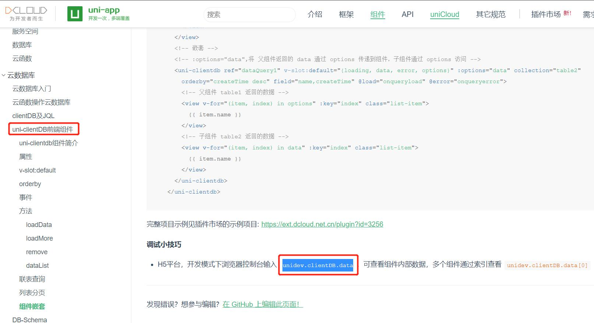

## UniCloud数据库 
[unicloud数据库文档][uniCloud_database]

### 一、对集合`Collection`的操作
通过 `db.collection(name)` 可以获取指定集合的引用，在集合上可以进行以下操作

|类型	|接口		|说明											|
|------|------------|------------|
|写	|[add][database_add]		|新增记录（触发请求）							|
|计数	|count		|获取符合条件的记录条数							|
|读	|get		|获取集合中的记录，如果有使用 where 语句定义查询条件，则会返回匹配结果集 (触发请求)|
|引用	|doc		|获取对该集合中指定 id 的记录的引用				|
|查询条件	|where		|通过指定条件筛选出匹配的记录，可搭配查询指令（eq, gt, in, ...）使用|
||skip		|跳过指定数量的文档，常用于分页，传入 offset	|
||orderBy	|排序方式										|
||limit		|返回的结果集(文档数量)的限制，有默认值和上限值	|
||field		|指定需要返回的字段								|

> 查询及更新指令用于在 `where` 中指定字段需满足的条件，指令可通过 `db.command` 对象取得。

#### 二、 记录 Record / Document
> 通过 `db.collection(collectionName).doc(docId)` 可以获取指定集合上指定 id 的记录的引用，在记录上可以进行以下操作

|接口	|说明					|					|
|------|------------|------------|
|写		|set					|覆写记录			|
||update					|局部更新记录(触发请求)|
||remove					|删除记录(触发请求)	|
|读		|get					|获取记录(触发请求)	|

#### 三、查询筛选指令 Query Command

>以下指令挂载在 `db.command` 下

|类型	|接口		|说明								|
|------|------------|------------|
|比较运算	|eq			|字段等于 ==						|
||neq		|字段不等于 !=						|
||gt			|字段大于 >							|
||gte		|字段大于等于 >=					|
||lt			|字段小于 <							|
||lte		|字段小于等于 <=					|
||in			|字段值在数组里						|
||nin		|字段值不在数组里					|
|逻辑运算	|and		|表示需同时满足指定的所有条件		|
||or			|表示需同时满足指定条件中的至少一个	|

#### 四、字段更新指令 Update Command
> 以下指令挂载在 `db.command` 下

|类型	|接口	|说明								|
|------|------------|------------|
|字段	|set	|设置字段值							|
||remove	|删除字段							|
||inc	|加一个数值，原子自增				|
||mul	|乘一个数值，原子自乘				|
||push	|数组类型字段追加尾元素，支持数组	|
||pop	|数组类型字段删除尾元素，支持数组	|
||shift	|数组类型字段删除头元素，支持数组	|
||unshift|数组类型字段追加头元素，支持数组	|

### 日志
使用`uni-clientdb`控件时，在浏览器查看所有数据可以使用`unidev.clientDB.data`

[uniCloud_database]:https://uniapp.dcloud.net.cn/uniCloud/cf-database?id=集合-collection
[database_add]:UniCloud/新增文档.md