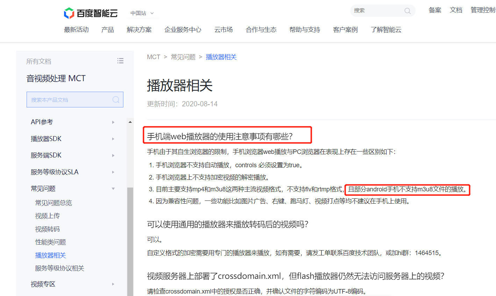
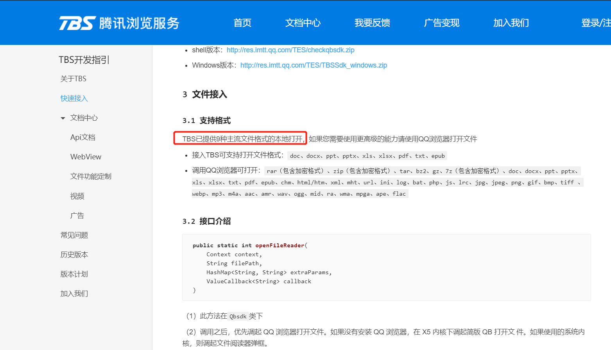

# 项目中的知识记录
移动端h5使用的框架：echarts、lib-flexible、vue

## 一、视频流播放器

### 百度视频播放器
> https://cloud.baidu.com/doc/MCT/s/zjwvz4w4z


### 腾讯视频播放器
> https://cloud.tencent.com/document/product/881/20213


腾讯的Android视频播放器代码还是比较简单的，自己后面又加了一个进度提示的效果。

百度的视频播放器有bug，工程师也没有解决。

m3u8视频流地址：http://cctvalih5ca.v.myalicdn.com/live/cctv1_2/index.m3u8

## 二、H5和Android交互

### h5和Android的App方法互调

1.h5跳转APP扫码界面[test.vue][test.vue]
```
toAppScanActivity() {
  window.android.toAppScanActivity()
}
```

2.Android回调h5方法[JSObject.java][JSObject.java]
```
@SuppressLint("SetJavaScriptEnabled")
public void fromAppScanResult(String data) {
    String scanResult = GsonUtils.toJson(new ScanResult(data));
    Log.i("TestScanActivity", scanResult);
    mWebView.loadUrl("javascript:fromAppScanResult(" + scanResult + ")");
}
```

3.Android方法编写[FullscreenActivity.java][FullscreenActivity.java]
```
//异步处理
private Handler mHandler = new Handler() {
    @Override
    public void handleMessage(Message msg) {
        super.handleMessage(msg);
        switch (msg.what) {
            case 1000:
                finish();
                break;
        }
    }
};
//定义与js交互的数据类
private JSObject jsobject = JSObject.setInstance(FullscreenActivity.this, mHandler, mWebView);
//注意第二个参数android，这个是JS网页调用Android方法的一个类似ID的东西
mWebView.addJavascriptInterface(jsobject, "android");
```


### H5跳转Android的App的方法
1.Android代码编写
```
<activity
    android:name=".module.FullscreenActivity"
    android:screenOrientation="portrait">
    <intent-filter>
        <action android:name="android.intent.action.MAIN" />
        <category android:name="android.intent.category.LAUNCHER" />
        <action android:name="android.intent.action.VIEW" />
    </intent-filter>
    <intent-filter> <!--URL Scheme启动  wzdsecurity://home_activity-->
        <!--必有项-->
        <action android:name="android.intent.action.VIEW"/>
        <!--如果希望该应用可以通过浏览器的连接启动，则添加该项-->
        <category android:name="android.intent.category.BROWSABLE"/>
        <!--表示该页面可以被隐式调用，必须加上该项-->
        <category android:name="android.intent.category.DEFAULT"/>
        <!--协议部分-->
        <data android:scheme="wzdsecurity"
            android:host="home_activity"/>
    </intent-filter>
</activity>
```
2.H5代码编写
```
<a href="wzdsecurity://home_activity">
	<button type="primary" size="mini">打开智慧涠洲</button>
</a>

<a href="wzdsecurity://home_activity">打开智慧涠洲</a>
```


[test.vue]:code/test.vue
[JSObject.java]:code/JSObject.java
[FullscreenActivity.java]:code/FullscreenActivity.java
