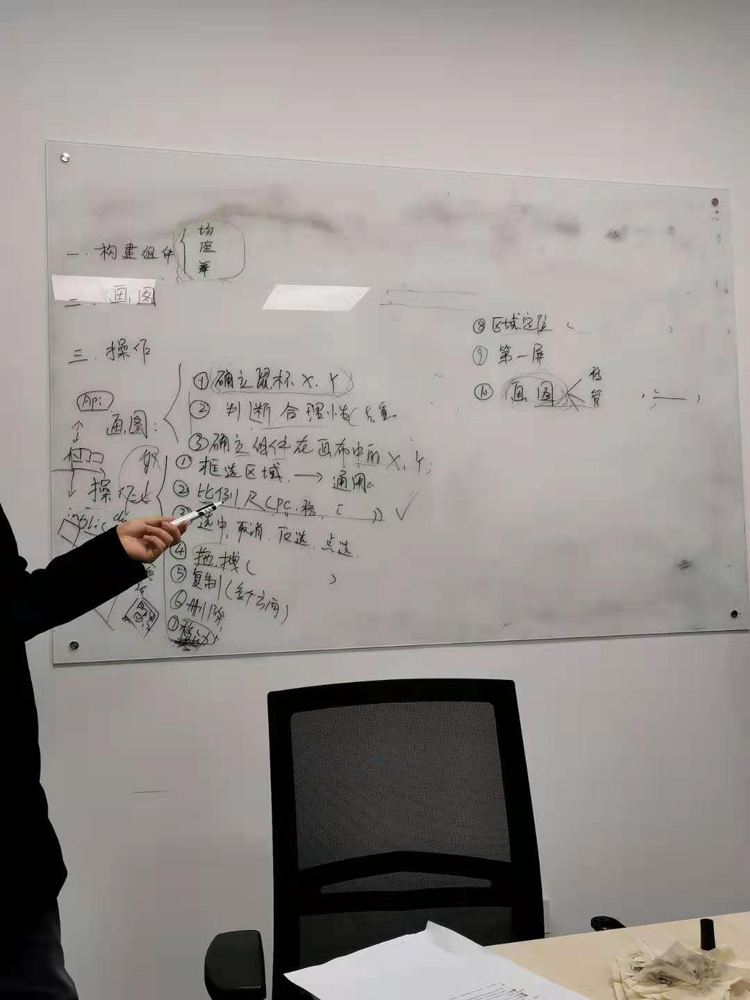

### 1.确定鼠标x，y
方法名：`getMousePosition()`；鼠标点击画布后，画布对象返回的鼠标的x,y

输入参数
---
|   参数	   |  是否必须 |  说明 |  备注 |
|-------|-------|-------|-------|
|canvas	|是	|画布对象    	|
|type	|是	|点击/放开  	|

输出参数
---
|   参数	   |  是否必须 |  说明 |  备注 |
|-------|-------|-------|-------|
|Point	|是	|Point对象(x轴坐标,y轴坐标)    	|

```
示例
getMousePosition(canvas，type){
    var x=null,y=null;
    canvas.addEventListener("click",
        function (e) {
          let x = e.clientX - canvas.getBoundingClientRect().left;
          let y = e.clientY - canvas.getBoundingClientRect().top;
          // console.info(x, y);
        },false);
    return [x,y];
}
```

### 2.判断合理性
方法名：`computeDownSuitable`;根据画板中已经放置的组件，操作类型及传入的操作数据返回是否合理；

输入参数
---
|   参数	   |  是否必须 |  说明 |  备注 |
|-------|-------|-------|-------|
|canvas	|是	|画布对象    	|
|mSeatList	|是	|画布里面已经放置的座位数组  	|
|selSeatList	|是	|需要修改的座位数组  	|
|type	|是	|操作类型：add：新增；move：移动；copy：复制  	|

输出参数
---
|   参数	   |  是否必须 |  说明 |  备注 |
|-------|-------|-------|-------|
| boolean	|是	| 是否合理    	|

判断`type`类型是`新增`还是`修改`：

* 1.如果是新增就遍历`mSeatList`判断和`selSeatList`中的数据是否有区域重合，没有重合就合理。
* 2.如果是修改就从`mSeatList`中移除`selSeatList`,然后遍历数组判断是否有区域重合，没有重合就合理。
>返回suitable(是否合理):true或者false；
```
/*
 * type:操作类型 add，move，copy
 */
computeDownSuitable(mSeatList,canvas,selSeatList,type){
    ......
    return true/false；
}
```

### 3.确定组件在画布的x，y
方法名：`getComponentPosition`;确定组件在画布占据的区域里面的起点对象、终点对象。

输入参数
---
|   参数	   |  是否必须 |  说明 |  备注 |
|-------|-------|-------|-------|
|mousePosition	|是	|鼠标点击的位置 |
|component	|是	|组件  	|

输出参数
---
|   参数	   |  是否必须 |  说明 |  备注 |
|-------|-------|-------|-------|
|[startPoint,endPoint]	|是	|起点、终点的坐标值数组   	|

```
getComponentPosition(mousePosition,component){
    return [(startX,startY),(endX,endY)]
}
```

# 

